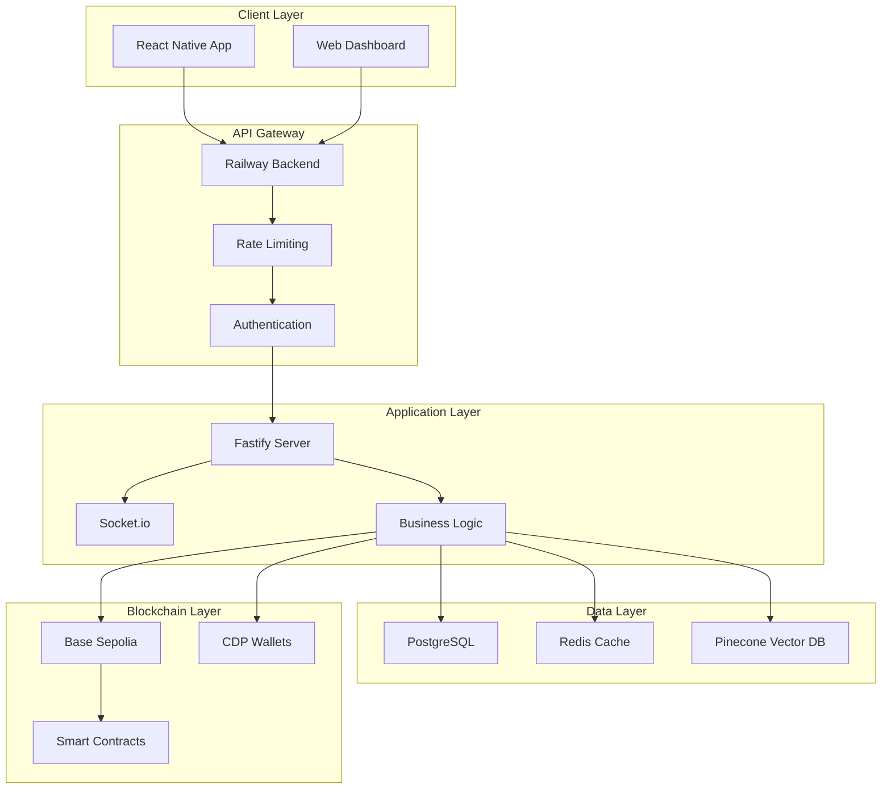
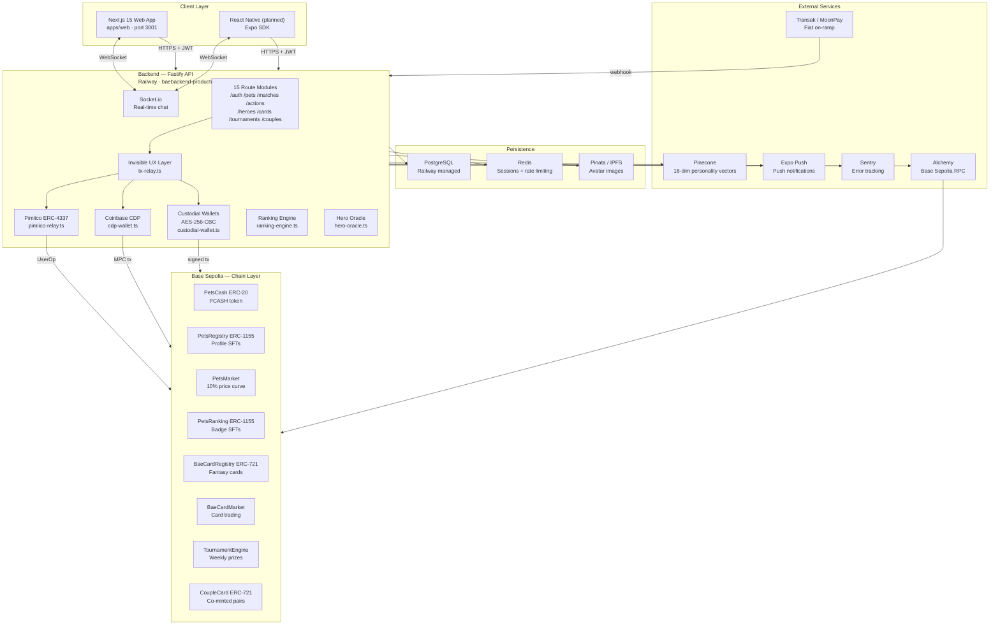
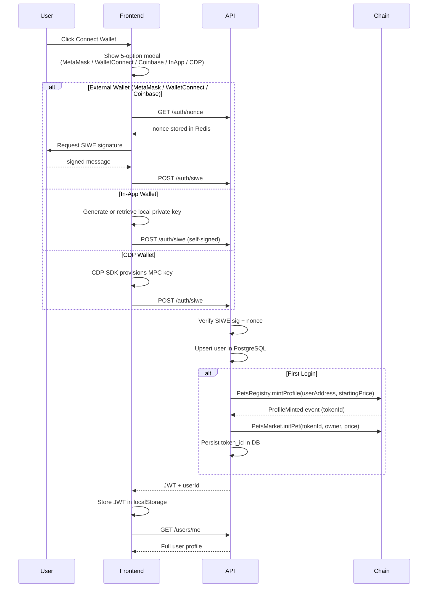
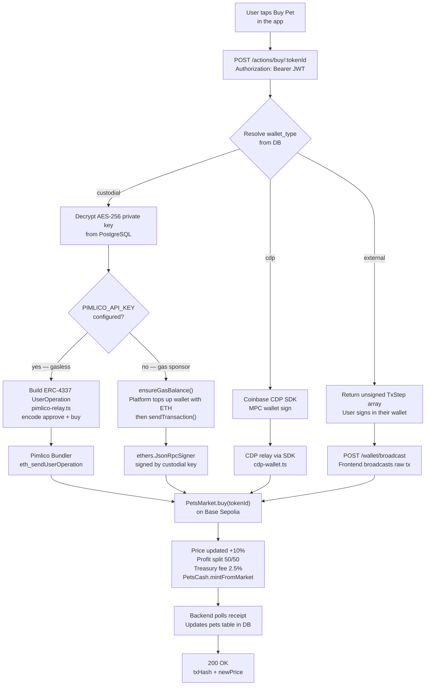
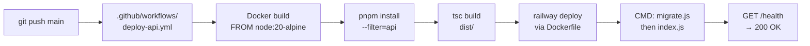

<div align="center">

# Bae4U

**Web3 SocialFi Dating Protocol on Base L2**

[](https://baebackend-production.up.railway.app/health)
[](https://sepolia.basescan.org)
[](LICENSE)
[](https://nodejs.org)
[](https://pnpm.io)
[](https://baebackend-production.up.railway.app/docs)

A full-stack SocialFi dating application where every user profile is an on-chain SFT, every match earns passive income, and all blockchain complexity is completely invisible to the end user.

[**Live API**](https://baebackend-production.up.railway.app) · [**Interactive Docs**](https://baebackend-production.up.railway.app/docs) · [**Fantasy Bae API Reference**](docs/FANTASY_BAE_API_REFERENCE.md) · [**Frontend Integration Guide**](docs/FANTASY_BAE_FRONTEND_INTEGRATION.md)

## 🏗️ Architecture Overview

### System Architecture



### Production-Grade Features

#### 🔒 Security
- **Rate Limiting**: Redis-based rate limiting with configurable limits per endpoint
- **SIWE Authentication**: Enhanced replay protection with nonce expiration and timestamp validation
- **Input Validation**: Comprehensive Zod schemas for all API inputs
- **SQL Injection Prevention**: Parameterized queries throughout the application
- **Security Headers**: Helmet.js with TLS pinning for mobile apps

#### ⚡ Performance
- **Database Indexes**: Strategic indexes for matches, users, hero_scores, and messages tables
- **Pagination**: All list endpoints support pagination with metadata
- **Connection Pooling**: Optimized PostgreSQL connection management
- **Redis Caching**: Session management, rate limiting, and frequently accessed data
- **Vector Search**: Pinecone integration for personality-based matching

#### 📊 Monitoring & Observability
- **Health Checks**: Comprehensive health endpoints for all system components
- **Structured Logging**: Pino logging with correlation IDs
- **Error Tracking**: Detailed error reporting with context
- **Performance Metrics**: Response times, error rates, and business KPIs
- **Database Monitoring**: Query performance and connection pool metrics

#### 🚀 Scalability
- **Horizontal Scaling**: Stateless API design for easy scaling
- **Load Balancing**: Ready for multiple instance deployment
- **Database Optimization**: Query optimization and proper indexing
- **Caching Strategy**: Multi-level caching for performance
- **Background Jobs**: Workers for intensive operations

</div>

---

## Table of Contents

- [What is Bae4U](#what-is-bae4u)
- [System Architecture](#system-architecture)
- [Deployed Contracts](#deployed-contracts)
- [Monorepo Structure](#monorepo-structure)
- [Application Layers](#application-layers)
- [Auth Flow](#auth-flow)
- [Invisible UX — Transaction Relay](#invisible-ux--transaction-relay)
- [Database Schema](#database-schema)
- [External Services](#external-services)
- [API Reference](#api-reference)
- [Local Development](#local-development)
- [E2E Test Suites](#e2e-test-suites)
- [Load Testing](#load-testing)
- [Deployment](#deployment)
- [Environment Variables](#environment-variables)
- [Security](#security)
- [Further Reading](#further-reading)

---

## What is Bae4U

Bae4U merges a swipe-based dating app with a pet-trading game economy. Every user profile mints a unique SFT on Base. Owning someone's SFT earns passive income every time they get bought by someone else — a bonding-curve economy where popularity literally pays. The entire blockchain layer is invisible: users log in with SIWE, and all gas, approvals, and transaction routing are handled server-side via custodial wallets, Coinbase CDP (MPC), or Pimlico ERC-4337 paymasters.

**Fantasy Bae** is a second layer — a fantasy sports-style card game where users collect Bae Cards, form decks, enter weekly tournaments, and mint Couple Cards as EIP-712 co-signed NFTs.

---

## System Architecture



---

## Deployed Contracts

### Base Sepolia Testnet (Chain ID: 84532)

> Latest deployment: `2026-05-07` — [`sepolia/deployments.json`](sepolia/deployments.json)

#### Core Protocol — Pet Economy

| Contract | Standard | Address | Basescan |
|---|---|---|---|
| **PetsCash** — in-game currency | ERC-20 | `0x10239e1127Ed9e179B98c94530b5C8EC7834Da8D` | [View ↗](https://sepolia.basescan.org/address/0x10239e1127Ed9e179B98c94530b5C8EC7834Da8D#code) |
| **PetsRegistry** — profile SFTs | ERC-1155 | `0xAb49505dDA3304BB976878b2103F717674d0C47A` | [View ↗](https://sepolia.basescan.org/address/0xAb49505dDA3304BB976878b2103F717674d0C47A#code) |
| **PetsMarket** — 10% bonding curve | — | `0x067Dd0189805bb716673d24fb44BDd054A5Debed` | [View ↗](https://sepolia.basescan.org/address/0x067Dd0189805bb716673d24fb44BDd054A5Debed#code) |
| **PetsRanking** — badge SFTs | ERC-1155 | `0x001F9838556De79Ff94f924Ac409a2E3a1ab021D` | [View ↗](https://sepolia.basescan.org/address/0x001F9838556De79Ff94f924Ac409a2E3a1ab021D#code) |

#### Fantasy Bae Layer — Card Game

| Contract | Standard | Address | Basescan |
|---|---|---|---|
| **BaeCardRegistry** — fantasy cards | ERC-721 | `0xf220F9d3fb4Fe7B91cdEB53F113C551c55880a58` | [View ↗](https://sepolia.basescan.org/address/0xf220F9d3fb4Fe7B91cdEB53F113C551c55880a58#code) |
| **BaeCardMarket** — card trading | — | `0x1cBEBC20DF461430d0673C71Ba78672C8799090C` | [View ↗](https://sepolia.basescan.org/address/0x1cBEBC20DF461430d0673C71Ba78672C8799090C#code) |
| **TournamentEngine** — weekly prizes | — | `0xf07D28F6B26168e35D2771ba293713bB91877c34` | [View ↗](https://sepolia.basescan.org/address/0xf07D28F6B26168e35D2771ba293713bB91877c34#code) |
| **CoupleCard** — EIP-712 co-mint | ERC-721 | `0xEe13aF76c55A83CC9b34f296040AFC60C772BA00` | [View ↗](https://sepolia.basescan.org/address/0xEe13aF76c55A83CC9b34f296040AFC60C772BA00#code) |

**Deployer / Treasury / Signer:** `0xa58DCCb0F17279abD1d0D9069Aa8711Df4a4c58E`

#### Key On-Chain Mechanics

| Mechanic | Contract | Detail |
|---|---|---|
| Profile mint | `PetsRegistry.mintProfile()` | Backend calls on first SIWE login; mints ERC-1155 SFT to user wallet |
| PCASH bonus | `PetsCash.claimBonus()` | EIP-712 signed claim; 4-hour cooldown enforced on-chain |
| Pet purchase | `PetsMarket.buy()` | Price increases exactly 10% per buy; profit splits 50/50 (prevOwner + pet profile); 2.5% to treasury |
| Pet lock | `PetsMarket.lockPet()` | Owner temporarily locks for up to 7 days; auto-expires on next buy |
| Cash gift | `PetsMarket.giftCash()` | Ranked owner gifts PCASH to pet profile; max 10 gifts/day |
| Badge issue | `PetsRanking.issueBadge()` | EIP-712 signed proof from backend; tiers: Bronze → Silver → Gold → Diamond → Master |
| Card mint | `BaeCardRegistry.mintCard()` | 4 rarities (Common / Rare / Epic / Legendary); rarity multiplier boosts tournament score |
| Couple mint | `CoupleCard.mintCouple()` | Both users sign EIP-712; NFT burned if couple unmatch |
| Tournament | `TournamentEngine` | Backend opens round → users lock decks → backend submits scores → users `claimPrize()` |

---

## Monorepo Structure

```
bae4u/
├── apps/
│   ├── api/                            # Fastify backend (Node.js 20)
│   │   ├── src/
│   │   │   ├── config.ts               # Zod env validation — startup gate
│   │   │   ├── index.ts                # Bootstrap: plugins, routes, TLS pin hook
│   │   │   ├── db/
│   │   │   │   ├── schema.sql          # Base schema (run once)
│   │   │   │   ├── migrate.ts          # Core migration runner
│   │   │   │   ├── migrate-patch.ts
│   │   │   │   ├── migrate-features.ts
│   │   │   │   ├── migrate-fantasy.ts      # Fantasy layer tables
│   │   │   │   ├── migrate-fantasy-bae.ts  # Bae Card / Tournament tables
│   │   │   │   └── migrate-performance.ts  # Indexes + perf schema
│   │   │   ├── plugins/
│   │   │   │   ├── db.ts               # PostgreSQL pool
│   │   │   │   ├── redis.ts            # ioredis
│   │   │   │   ├── auth.ts             # @fastify/jwt + SIWE verifier
│   │   │   │   └── socket.ts           # Socket.io real-time chat
│   │   │   ├── middleware/
│   │   │   │   └── rateLimiter.ts      # Redis token bucket + admin bypass
│   │   │   ├── routes/
│   │   │   │   ├── auth.ts             # /auth/nonce, /auth/siwe
│   │   │   │   ├── users.ts            # /users/me, avatar upload
│   │   │   │   ├── pets.ts             # /pets, /pets/:id, portfolio
│   │   │   │   ├── actions.ts          # /actions/buy, /lock, /gift (relay)
│   │   │   │   ├── bonus.ts            # /bonus/claim, /bonus/status
│   │   │   │   ├── matches.ts          # /matches, /matches/discover, /matches/like
│   │   │   │   ├── messages.ts         # /messages/:matchId
│   │   │   │   ├── rankings.ts         # /rankings/global, badge-proof
│   │   │   │   ├── wallet.ts           # /wallet/balance, /history, /broadcast
│   │   │   │   ├── fiat.ts             # Transak / MoonPay webhooks
│   │   │   │   ├── admin.ts            # Internal admin
│   │   │   │   ├── heroes.ts           # Fantasy hero scores + oracle
│   │   │   │   ├── cards.ts            # Bae Card market
│   │   │   │   ├── tournaments.ts      # Tournament lifecycle
│   │   │   │   └── couples.ts          # Couple Card co-mint
│   │   │   ├── services/
│   │   │   │   ├── tx-relay.ts         # Invisible UX dispatcher
│   │   │   │   ├── pimlico-relay.ts    # ERC-4337 UserOp builder
│   │   │   │   ├── custodial-wallet.ts # AES-256-CBC key management
│   │   │   │   ├── cdp-wallet.ts       # Coinbase CDP MPC wallets
│   │   │   │   ├── eip712-signer.ts    # Bonus/badge signature issuer
│   │   │   │   ├── pinecone-match.ts   # 18-dim personality vector match
│   │   │   │   ├── ranking-engine.ts   # Leaderboard computation
│   │   │   │   ├── hero-oracle.ts      # Fantasy hero score oracle
│   │   │   │   ├── pets-sync.ts        # Chain → DB pet state sync
│   │   │   │   ├── token-gate.ts       # Badge-gated feature checks
│   │   │   │   ├── ipfs.ts             # Pinata avatar uploads
│   │   │   │   └── push.ts             # Expo push notification sender
│   │   │   └── workers/
│   │   │       ├── pets-sync.worker.ts  # BullMQ: chain → DB sync
│   │   │       └── ranking.worker.ts    # BullMQ: weekly rank compute
│   │   ├── scripts/                     # E2E and ops scripts
│   │   │   ├── e2e-test.ts
│   │   │   ├── full-stack-e2e.ts        # 95-section integration suite
│   │   │   ├── gameflow-e2e.ts          # 9-step on-chain game flow
│   │   │   ├── gameflow-v2-e2e.ts       # Fantasy Bae contract tests
│   │   │   ├── pimlico-e2e.ts           # ERC-4337 gasless flow
│   │   │   ├── cdp-smoke.ts             # CDP MPC smoke test
│   │   │   ├── railway-e2e.ts           # 28-section live HTTP test
│   │   │   ├── fantasy-e2e.ts
│   │   │   ├── fantasy-bae-e2e.ts
│   │   │   └── production-health.ts
│   │   ├── Dockerfile
│   │   └── package.json
│   └── web/                             # Next.js 15 frontend
│       ├── app/
│       │   ├── page.tsx                 # Landing — aurora hero
│       │   ├── discover/page.tsx        # Swipe cards + country filter + match popup
│       │   ├── pets/page.tsx            # Pet marketplace (relay buy/lock)
│       │   ├── matches/page.tsx         # Real-time chat + match list
│       │   └── profile/page.tsx         # Profile + avatar upload + bonus timer + portfolio
│       ├── components/
│       │   ├── auth-provider.tsx        # React context: session + login
│       │   ├── wallet-modal.tsx         # 5-option wallet connect modal
│       │   ├── navbar.tsx               # Top bar + mobile bottom nav
│       │   └── [React Bits components]  # Aurora, SpotlightCard, ClickSpark…
│       ├── lib/
│       │   ├── api.ts                   # All API calls + JWT management
│       │   ├── wallet.ts                # MetaMask / WalletConnect / Coinbase / InApp connect
│       │   └── store.ts                 # AuthContext type definitions
│       └── package.json
├── packages/
│   └── contracts/                       # Original 4 core contracts (Hardhat)
│       └── contracts/
│           ├── PetsCash.sol
│           ├── PetsRegistry.sol
│           ├── PetsMarket.sol
│           └── PetsRanking.sol
├── sepolia/                             # Full 8-contract suite (current deployment)
│   ├── contracts/
│   │   ├── PetsCash.sol
│   │   ├── PetsRegistry.sol
│   │   ├── PetsMarket.sol
│   │   ├── PetsRanking.sol
│   │   ├── BaeCardRegistry.sol
│   │   ├── BaeCardMarket.sol
│   │   ├── TournamentEngine.sol
│   │   └── CoupleCard.sol
│   ├── deployments.json                 # Canonical deployed addresses
│   └── hardhat.config.ts
├── load-tests/                          # k6 performance test suite (12 scenarios)
├── docs/
│   ├── FANTASY_BAE_API_REFERENCE.md
│   └── FANTASY_BAE_FRONTEND_INTEGRATION.md
├── .env.example                         # All env vars documented
├── .github/workflows/deploy-api.yml     # CI/CD to Railway
├── Dockerfile                           # Multi-stage build
├── railway.json                         # Railway deployment config
└── pnpm-workspace.yaml
```

---

## Application Layers

### Layer 1 — Core Dating App (Pet Economy)

```
User signs up
  └─ SIWE login → Profile SFT minted on-chain (PetsRegistry)
       └─ Appears in Discover feed of other users
            └─ Swipe right → Like stored in DB → Pinecone personality vector match
                 └─ Mutual like → Match created → Real-time chat (Socket.io)
                      └─ Daily PCASH bonus claim (EIP-712 via PetsCash.claimBonus)
                           └─ Pet marketplace: buy other users' SFTs via PetsMarket.buy()
                                └─ Price rises 10% each buy
                                     └─ Previous owner earns passive profit (50% of gain)
                                          └─ Pet profile earns passive profit (50% of gain)
```

### Layer 2 — Fantasy Bae (Card Game)

```
Collect Bae Cards (4 rarities: Common / Rare / Epic / Legendary)
  └─ Cards represent real dating app user profiles
       └─ Build a 5-card deck
            └─ Enter weekly tournament: TournamentEngine.lockDeck()
                 └─ Backend hero oracle scores each card based on real app activity
                      └─ Backend submits scores: TournamentEngine.submitScores()
                           └─ Top players claim prize: TournamentEngine.claimPrize() → PCASH
                                └─ Couple Card: mutual EIP-712 sign → CoupleCard.mintCouple()
                                     └─ Burned if couple unmatch
```

---

## Auth Flow



---

## Invisible UX — Transaction Relay

Every on-chain action (`buy`, `lock`, `gift`) goes through the relay layer so users never see gas, private keys, or approval transactions.



**Gas priority order:**
1. **Pimlico ERC-4337 Paymaster** — `PIMLICO_API_KEY` set → zero ETH in user wallet
2. **Platform gas sponsorship** — deployer ETH tops up user wallet to minimum balance
3. **User self-pays** — external wallet type, user signs and broadcasts

---

## Database Schema

PostgreSQL on Railway. Run migrations in order on fresh instance.

| Table | Purpose |
|---|---|
| `users` | Wallet address, display name, bio, country code, personality vector (JSONB), token_id, wallet_type, avatar_ipfs_hash |
| `pets` | On-chain pet state mirror: owner, price, isLocked, lockExpiry, totalBuys, pet_status |
| `matches` | Swipe results with status: `pending` / `matched` / `unmatched` |
| `messages` | Chat messages per match (types: text / image / gif / audio) |
| `swipe_passes` | Blocked from discover: users who swiped left |
| `push_tokens` | Expo push token per user (for iOS + Android push) |
| `rankings` | Computed leaderboard snapshots (daily / weekly / monthly periods) |
| `fiat_orders` | Transak / MoonPay on-ramp transaction records |
| `custodial_wallets` | AES-256-CBC encrypted private keys; wallet_address indexed |
| `bonus_claims` | On-chain bonus claim history |
| `bae_cards` | Fantasy card ownership, rarity, subject_address, multiplier |
| `tournaments` | Tournament rounds, decks, submitted scores |
| `couple_cards` | Co-minted couple NFT records, partner addresses, on-chain token_id |

**Migration order:**
```bash
pnpm --filter=api migrate              # Base schema (users, pets, matches, messages)
pnpm --filter=api migrate:patch        # Custodial wallet columns
pnpm --filter=api migrate:features     # Rankings, push tokens, swipe passes
pnpm --filter=api migrate:fantasy      # Fantasy hero scores, bae_cards
pnpm --filter=api migrate:fantasy-bae  # Tournaments, couple_cards
pnpm --filter=api migrate-performance  # Indexes, JSONB GIN indexes, query planner hints
```

---

## External Services

| Service | Purpose | Required? | Env Var(s) |
|---|---|---|---|
| **Alchemy** | Base Sepolia RPC + archive node | Yes | `BASE_SEPOLIA_RPC_URL` |
| **Railway** | API hosting, PostgreSQL, Redis | Yes | Auto-injected |
| **Pimlico** | ERC-4337 bundler + paymaster (gasless) | Optional | `PIMLICO_API_KEY` |
| **Coinbase CDP** | MPC wallets — no raw key in DB | Optional | `CDP_API_KEY_ID`, `CDP_API_KEY_SECRET`, `CDP_WALLET_SECRET` |
| **Pinecone** | 18-dim personality vector similarity search | Optional | `PINECONE_API_KEY`, `PINECONE_INDEX` |
| **Pinata** | IPFS avatar image pinning + CDN | Optional | `PINATA_JWT` |
| **Expo** | iOS + Android push notifications | Optional | `EXPO_ACCESS_TOKEN` |
| **Transak** | Fiat → crypto card payment on-ramp | Optional | `TRANSAK_API_KEY`, `TRANSAK_SECRET` |
| **MoonPay** | Fiat → crypto alternative on-ramp | Optional | `MOONPAY_API_KEY` |
| **Sentry** | Error tracking + performance monitoring | Optional | `SENTRY_DSN` |
| **Mixpanel** | Product analytics + funnels | Optional | `MIXPANEL_TOKEN` |
| **Basescan** | Contract verification (Etherscan V2, chainId=84532) | Dev only | `BASESCAN_API_KEY` |

---

## API Reference

**Base URL:** `https://baebackend-production.up.railway.app`

**Auth:** All routes except `/health` and `/auth/*` require `Authorization: Bearer <jwt>`

**Interactive Swagger UI:** [`/docs`](https://baebackend-production.up.railway.app/docs)  
**OpenAPI JSON:** [`/docs/json`](https://baebackend-production.up.railway.app/docs/json)

| Prefix | Key Endpoints | Description |
|---|---|---|
| `/auth` | `GET /nonce` · `POST /siwe` | SIWE login; JWT issued on success |
| `/users` | `GET /me` · `PATCH /me` · `POST /me/avatar` · `POST /me/push-token` | Profile management + IPFS avatar |
| `/pets` | `GET /` · `GET /:id` · `GET /portfolio/:address` · `GET /:id/history` | Pet market feed, detail, portfolio, tx history |
| `/actions` | `POST /buy/:tokenId` · `POST /lock/:tokenId` · `POST /gift/:tokenId` · `POST /setup-wallet` | Invisible UX relay — all on-chain mutations |
| `/bonus` | `POST /claim` · `GET /status` | EIP-712 PCASH daily bonus (4-hour cooldown) |
| `/matches` | `GET /` · `GET /discover` · `POST /like/:userId` · `DELETE /:matchId` | Swipe queue + match management |
| `/messages` | `GET /:matchId` | Paginated message history per match |
| `/rankings` | `GET /global` · `GET /badge-proof/:userId` | Leaderboard + backend-signed badge proof |
| `/wallet` | `GET /balance` · `GET /history` · `POST /broadcast` | PCASH balance, tx history, external tx relay |
| `/fiat` | `POST /transak/webhook` · `POST /moonpay/webhook` | On-ramp provider webhook handlers |
| `/heroes` | `GET /leaderboard` · `GET /me` · `POST /score` | Fantasy Bae hero scores + oracle |
| `/cards` | `GET /` · `GET /:id` · `POST /list` · `POST /buy` · `POST /upgrade` | Bae Card market operations |
| `/tournaments` | `GET /` · `GET /active` · `POST /enter` · `POST /deck` · `POST /claim` | Full tournament lifecycle |
| `/couples` | `GET /` · `POST /propose` · `POST /accept` · `DELETE /:id` | Couple Card EIP-712 co-mint flow |
| `/admin` | `GET /users` · `POST /suspend` · `POST /mint` | Internal admin (restricted) |

**Real-time (Socket.io):** `wss://baebackend-production.up.railway.app`

| Event | Direction | Payload |
|---|---|---|
| `join_match` | Client → Server | `{ matchId }` |
| `send_message` | Client → Server | `{ matchId, content, type }` |
| `new_message` | Server → Client | `{ message }` |
| `match_notification` | Server → Client | `{ matchId, partnerName }` |

---

## Local Development

### Prerequisites

- Node.js 20+, pnpm 9+
- PostgreSQL 15+, Redis 7+
- Base Sepolia ETH ([Quicknode faucet](https://faucet.quicknode.com/base/sepolia))

### Setup

```bash
# 1. Clone + install
git clone https://github.com/your-org/bae4u.git
cd bae4u
pnpm install

# 2. Configure env
cp .env.example .env
# Edit: DATABASE_URL, REDIS_URL, JWT_SECRET, BASE_SEPOLIA_RPC_URL,
#       DEPLOYER_PRIVATE_KEY, SIGNER_PRIVATE_KEY + contract addresses

# 3. Run DB migrations in order
pnpm --filter=api migrate
pnpm --filter=api migrate:patch
pnpm --filter=api migrate:features
pnpm --filter=api migrate:fantasy
pnpm --filter=api migrate:fantasy-bae
pnpm --filter=api migrate-performance

# 4. Start API (hot-reload)
pnpm dev:api           # http://localhost:3000
                       # Swagger: http://localhost:3000/docs

# 5. Start frontend
pnpm --filter=web dev  # http://localhost:3001
```

### Deploy Contracts (fresh environment)

```bash
cd sepolia
# Fill in DEPLOYER_PRIVATE_KEY + BASE_SEPOLIA_RPC_URL in .env

pnpm deploy:contracts   # deploys all 8 contracts, writes deployments.json
pnpm verify:contracts   # verifies all on Basescan
```

### Start Background Workers

```bash
pnpm --filter=api worker:pets     # BullMQ: chain -> DB pet state sync
pnpm --filter=api worker:ranking  # BullMQ: weekly leaderboard computation
```

---

## E2E Test Suites

All test scripts use real Base Sepolia RPC and the live deployed backend.

```bash
# Core on-chain protocol (no backend needed)
pnpm --filter=api gameflow           # 9/9   — PetsCash, PetsRegistry, PetsMarket, PetsRanking
pnpm --filter=api pimlico-e2e        # 6/6   — ERC-4337 gasless txs via Pimlico
pnpm --filter=api cdp-smoke          # pass  — Coinbase CDP MPC wallet smoke test

# Fantasy Bae contract layer
pnpm --filter=api gameflow-v2        # BaeCardRegistry, BaeCardMarket, TournamentEngine, CoupleCard
pnpm --filter=api fantasy-bae-e2e   # Full Fantasy Bae integration

# Full-stack (DB + chain + HTTP)
pnpm --filter=api full-e2e           # 93/95 — DB, chain, SIWE, dating, pet economy, Fantasy Bae
pnpm --filter=api railway-e2e        # 28/28 — live HTTP against Railway deployment

# Multi-user concurrent flows
pnpm --filter=api multiuser
```

### What Each Suite Covers

| Suite | Sections | Coverage |
|---|---|---|
| `gameflow` | 9 | AES-256 wallet, gas sponsorship, mintProfile, initPet, EIP-712 claimBonus, buy() 1000→1100 PCASH price invariant, lockPet revert guard, giftCash, badge proof |
| `pimlico-e2e` | 6 | EOA with 0 ETH executes `claimBonus` + `lockPet` fully gasless via Pimlico ERC-4337 paymaster |
| `cdp-smoke` | — | CDP MPC wallet provisioning, SEC1→PKCS8 key normalisation, tx signing |
| `full-stack-e2e` | 95 | PostgreSQL, Redis, Base Sepolia RPC, 8 contracts, custodial wallets, SIWE, dating triangle (Satyam ↔ Vijendra ↔ Sakshi), pet economy, push tokens, personality vectors, Railway HTTP |
| `railway-e2e` | 28 | Live HTTP: auth, pets, discover, matches, rankings, push tokens, wallet, contract reads |
| `gameflow-v2` | — | BaeCardRegistry rarity mint, BaeCardMarket price curve, TournamentEngine full lifecycle, CoupleCard EIP-712 |

---

## Load Testing

Production-grade [k6](https://k6.io) suite in [`load-tests/`](load-tests/). See [`load-tests/README.md`](load-tests/README.md) for full SLA targets.

```bash
cd load-tests && npm install
export BASE_URL="https://baebackend-production.up.railway.app"

k6 run smoke-test.js           # 5 VUs, 1 min — basic sanity
k6 run mobile-session.js       # 50 VUs, 10 min — average user behaviour
k6 run login-burst.js          # 500 concurrent logins — auth stress
k6 run discover-swipe-flow.js  # Core swipe + match flow
k6 run cards-market-flow.js    # NFT marketplace browsing
k6 run tournament-flow.js      # Tournament participation
k6 run spike-test.js           # 0 → 1000 VUs in 30s
k6 run endurance-test.js       # 6-hour stability test
```

---

## Deployment

The API deploys automatically to Railway on every push to `main` via Docker.



**Docker start sequence:** run all migrations → `node apps/api/dist/index.js`

**Health check:** `GET /health` — returns `{ status, uptime, version, tlsPins }`

```bash
# Manual deploy
railway up

# View live logs
railway logs

# Set environment variable
railway variables --set "KEY=value"
```

---

## Environment Variables

Full reference: [`.env.example`](.env.example)

The API validates all required variables at startup via Zod — **server will not boot** if any required var is missing or malformed.

```bash
# ── Required ────────────────────────────────────────────────
PORT=3000
NODE_ENV=production
DATABASE_URL=postgresql://...
REDIS_URL=redis://...
JWT_SECRET=<64-char random hex>
JWT_REFRESH_SECRET=<64-char random hex>
BASE_SEPOLIA_RPC_URL=https://base-sepolia.g.alchemy.com/v2/...
DEPLOYER_PRIVATE_KEY=0x...
SIGNER_PRIVATE_KEY=0x...       # signs EIP-712 bonus/badge claims only — holds no ETH
PETS_CASH_ADDRESS=0x10239e1127Ed9e179B98c94530b5C8EC7834Da8D
PETS_REGISTRY_ADDRESS=0xAb49505dDA3304BB976878b2103F717674d0C47A
PETS_MARKET_ADDRESS=0x067Dd0189805bb716673d24fb44BDd054A5Debed
PETS_RANKING_ADDRESS=0x001F9838556De79Ff94f924Ac409a2E3a1ab021D

# ── Optional — enable features when set ────────────────────
PIMLICO_API_KEY=               # enables ERC-4337 fully gasless transactions
CDP_API_KEY_ID=                # enables Coinbase CDP MPC wallets
CDP_API_KEY_SECRET=
CDP_WALLET_SECRET=
PINECONE_API_KEY=              # enables AI personality-based matching
PINATA_JWT=                    # enables IPFS avatar uploads
EXPO_ACCESS_TOKEN=             # enables push notifications
TRANSAK_API_KEY=               # enables Transak fiat on-ramp
MOONPAY_API_KEY=               # enables MoonPay fiat on-ramp
SENTRY_DSN=                    # enables error tracking
MIXPANEL_TOKEN=                # enables product analytics

# ── Game economics (18-decimal wei) ────────────────────────
BONUS_AMOUNT_PCASH=100000000000000000000      # 100 PCASH per claim
STARTING_PRICE_PCASH=1000000000000000000000  # 1000 PCASH starting pet price
```

**Frontend** (`apps/web/.env.local`):

```bash
NEXT_PUBLIC_API_URL=https://baebackend-production.up.railway.app
NEXT_PUBLIC_CHAIN_ID=84532
NEXT_PUBLIC_PETS_CASH_ADDRESS=0x10239e1127Ed9e179B98c94530b5C8EC7834Da8D
NEXT_PUBLIC_PETS_MARKET_ADDRESS=0x067Dd0189805bb716673d24fb44BDd054A5Debed
NEXT_PUBLIC_PETS_REGISTRY_ADDRESS=0xAb49505dDA3304BB976878b2103F717674d0C47A
NEXT_PUBLIC_WC_PROJECT_ID=     # from cloud.walletconnect.com
```

---

## Security

| Mechanism | Detail |
|---|---|
| **Authentication** | SIWE — Sign-In With Ethereum (EIP-4361); nonce stored in Redis, single-use |
| **Session tokens** | JWT (HS256) + refresh token; stored in `localStorage` (web) or secure storage (mobile) |
| **EIP-712 structured data** | Used for bonus claims and badge proofs; includes domain separator + chain ID — prevents cross-chain replay |
| **Signature replay prevention** | `usedSigs` (PetsCash) and `usedProofs` (PetsRanking) mappings store digests permanently on-chain |
| **Rate limiting** | Redis token bucket on all routes; admin API key bypass for internal tooling |
| **Custodial key encryption** | AES-256-CBC; encryption secret in env only, never stored in DB alongside the ciphertext |
| **CDP wallets** | Coinbase MPC — raw private key never exists in single location; co-managed with Coinbase |
| **TLS certificate pinning** | `X-Cert-Sha256` response header on every reply; React Native app validates before parsing data |
| **CORS** | Production origin whitelist: `app.bae4u.com`, `admin.bae4u.com`, Railway URL, Expo dev tunnels |
| **Reentrancy** | `ReentrancyGuard` on `PetsMarket.buy()` |
| **CEI pattern** | Effects written before all external calls in market and bonus functions |
| **Pausable** | `PetsMarket` can be emergency-paused by `ADMIN_ROLE` |
| **Access control** | OpenZeppelin `AccessControl` on all 8 contracts; roles: `ADMIN_ROLE`, `MINTER_ROLE`, `SIGNER_ROLE`, `MARKET_ROLE`, `ISSUER_ROLE`, `AUTOMATION_ROLE` |
| **Zod env validation** | Server exits at startup if any required env var is missing, malformed, or below minimum length |

---

## Further Reading

| Document | Description |
|---|---|
| [`docs/FANTASY_BAE_API_REFERENCE.md`](docs/FANTASY_BAE_API_REFERENCE.md) | Complete Fantasy Bae API — heroes, cards, tournaments, couples |
| [`docs/FANTASY_BAE_FRONTEND_INTEGRATION.md`](docs/FANTASY_BAE_FRONTEND_INTEGRATION.md) | Frontend integration guide for the Fantasy Bae game layer |
| [`FRONTEND_INTEGRATION.md`](FRONTEND_INTEGRATION.md) | Core dating app frontend integration (screen-by-screen, Flutter + React Native) |
| [`load-tests/README.md`](load-tests/README.md) | k6 load test configuration, scenarios, and SLA targets |
| [`PRODUCTION_READINESS_AUDIT.md`](PRODUCTION_READINESS_AUDIT.md) | Full production readiness assessment across all layers |
| [`LAUNCH_READINESS_REPORT.md`](LAUNCH_READINESS_REPORT.md) | Launch checklist and readiness gate report |
| [`sepolia/deployments.json`](sepolia/deployments.json) | Canonical deployed contract addresses with deployment timestamp |
| [Live Swagger UI](https://baebackend-production.up.railway.app/docs) | Interactive API docs |
| [Basescan — PetsCash](https://sepolia.basescan.org/address/0x10239e1127Ed9e179B98c94530b5C8EC7834Da8D#code) | Verified contract source |
| [Basescan — PetsRegistry](https://sepolia.basescan.org/address/0xAb49505dDA3304BB976878b2103F717674d0C47A#code) | Verified contract source |
| [Basescan — PetsMarket](https://sepolia.basescan.org/address/0x067Dd0189805bb716673d24fb44BDd054A5Debed#code) | Verified contract source |
| [Basescan — PetsRanking](https://sepolia.basescan.org/address/0x001F9838556De79Ff94f924Ac409a2E3a1ab021D#code) | Verified contract source |
| [Basescan — BaeCardRegistry](https://sepolia.basescan.org/address/0xf220F9d3fb4Fe7B91cdEB53F113C551c55880a58#code) | Verified contract source |
| [Basescan — TournamentEngine](https://sepolia.basescan.org/address/0xf07D28F6B26168e35D2771ba293713bB91877c34#code) | Verified contract source |

---

<div align="center">

Built on [Base](https://base.org) &nbsp;·&nbsp; Deployed on [Railway](https://railway.app) &nbsp;·&nbsp; Gasless via [Pimlico](https://pimlico.io) &nbsp;·&nbsp; MPC wallets by [Coinbase CDP](https://cdp.coinbase.com)

</div>
